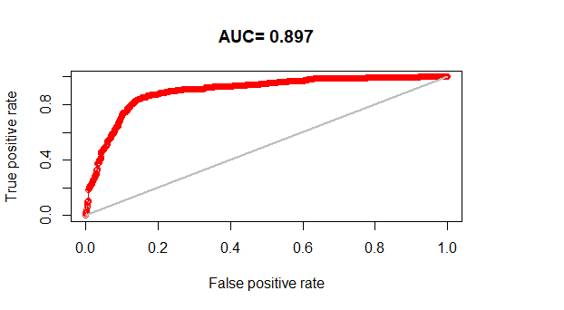
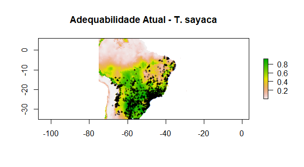
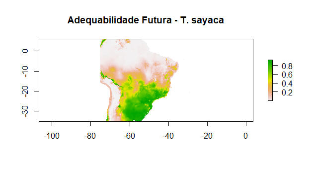
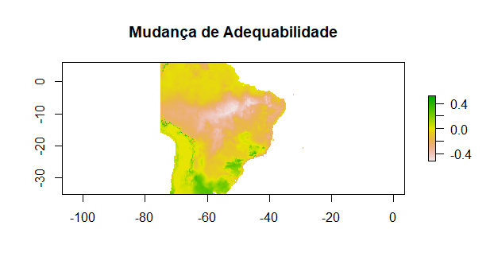

# Modelagem de distribuição de espécie (SDM) para Thraupis sayaca

[](https://www.r-project.org/)
[](https://biodiversityinformatics.amnh.org/open_source/maxent/)
[](https://cran.r-project.org/package=dismo)
[](https://www.gbif.org/)
[](https://www.worldclim.org/)

## Sumário
- [Dataset](#dataset)
- [Modelo](#modelo)
- [Como Executar](#como-executar)
- [Resultados](#resultados)

## Dataset

O projeto usa dois tipos de dados: ocorrências da espécie e variáveis ambientais.

- Ocorrências: arquivo `thraupis_sayaca_ocorrences2.csv`, contendo as colunas `decimalLongitude` e `decimalLatitude`, usadas para extrair as coordenadas de ocorrência da espécie. Os dados são uma amostra aleatória de 5000 registros, extraída de um conjunto do GBIF.

- Variáveis ambientais: dois arquivos no formato `.grd`, `env_current.grd` com as condições ambientais atuais e `env_forecast.grd` com a projeção futura (2050). Cada stack contém, entre outras camadas, `tmin` (temperatura mínima) e `precip` (precipitação). A variável `tmin` é dividida por 10 antes do uso, já que a temperatura é armazenada em décimos de grau.

## Modelo

A distribuição potencial da espécie foi modelada utilizando o algoritmo MaxEnt, com base nos registros de ocorrência da espécie e nas variáveis ambientais disponíveis.

Para avaliar o desempenho do modelo, os registros foram divididos em 80% para treino e 20% para teste. A avaliação foi realizada com 10.000 pontos de background gerados aleatoriamente, resultando em AUC = 0.897.

A conversão das predições contínuas para presença/ausência foi realizada utilizando o limiar spec_sens.



## Como executar

1. Instale as dependências:
```r
install.packages(c("dismo", "dplyr", "ggplot2"))
```
2. Coloque os arquivos de entrada na raiz do projeto (`thraupis_sayaca_ocorrences2.csv`, `env_current.grd`, `env_forecast.grd`).
3. Execute o script principal.

## Resultados

O modelo MaxEnt gerou o mapa de adequabilidade ambiental para as condições atuais, indicando as regiões com maior favorabilidade climática para a ocorrência da espécie:




A projeção para as condições ambientais futuras, do ano 2050, resultou no seguinte mapa de adequabilidade:



A diferença entre as duas projeções (futura menos atual) é apresentada abaixo, destacando as áreas de mudança na adequabilidade ambiental. Em vermelho, regiões onde a adequabilidade tende a diminuir, e em verde, regiões onde tende a aumentar.

